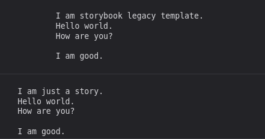

# legacyTemplate indent bug

```
<script>
    const text = `
I am just a story.
Hello world.
How are you?

I am good.
`
  console.log(text);
</script>

hello world
```

This is in `Test.svelte` and console logs correctly.

```
  const text = `
I am storybook legacy template.
Hello world.
How are you?

I am good.
`
  console.log(text);
```

This is in `Test.stories.svelte` and console logs with 4 spaces added to the start of each line.

